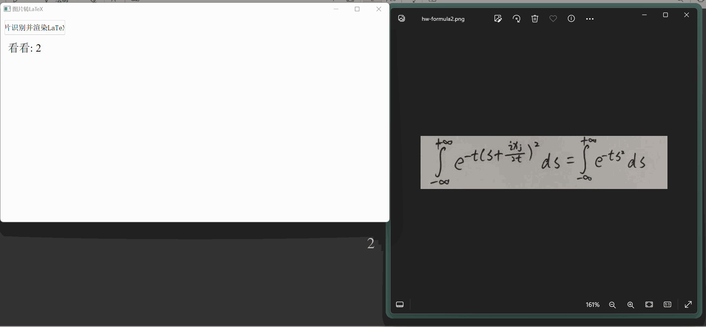
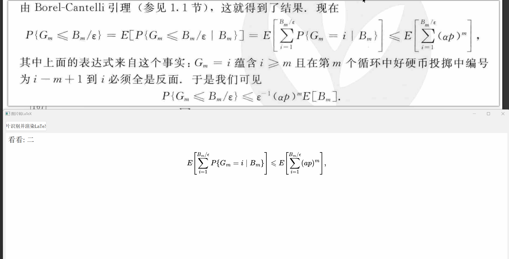
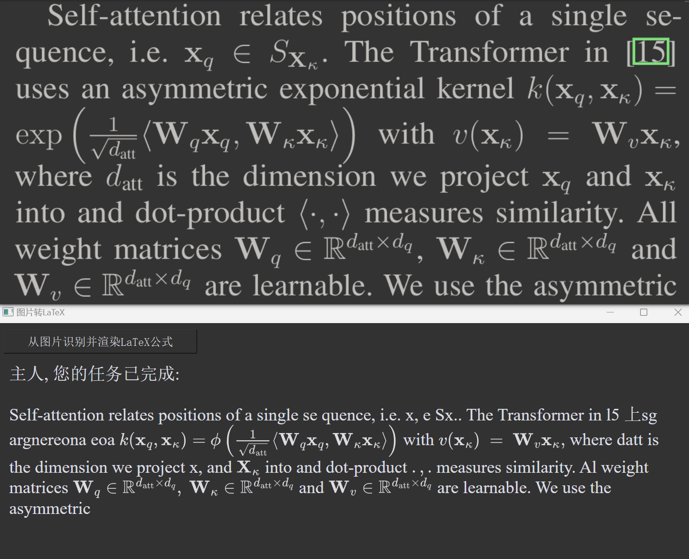
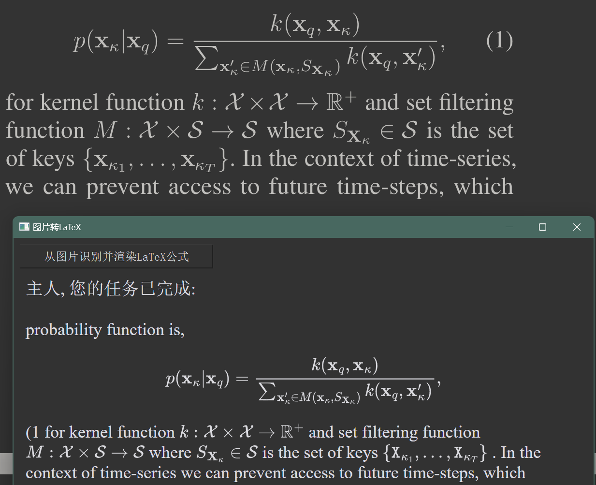

#### 模型作者: [breezedeus/Pix2Text: Pix In, Latex &amp; Text Out. Recognize Chinese, English Texts, and Math Formulas from Images. 80+ languages are supported. (github.com)](https://github.com/breezedeus/Pix2Text)

官方代码库：[https://github.com/breezedeus/pix2text](https://github.com/breezedeus/pix2text) 。

Pix2Text (P2T) 更多信息：[https://www.breezedeus.com/pix2text](https://www.breezedeus.com/pix2text) 。

- python版本3.9, 按requirements.txt安装依赖
- 执行3rec_and_render.py即可调用, 效果如下

---

---

---
---

- 修改为黑色界面
-  

